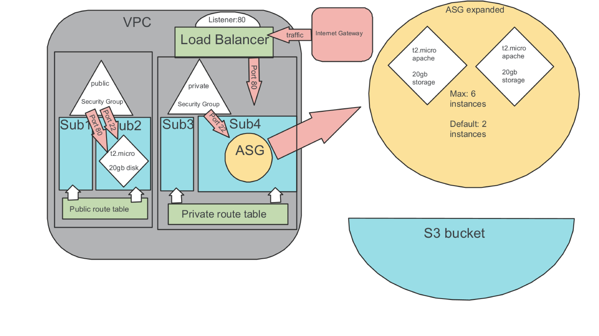
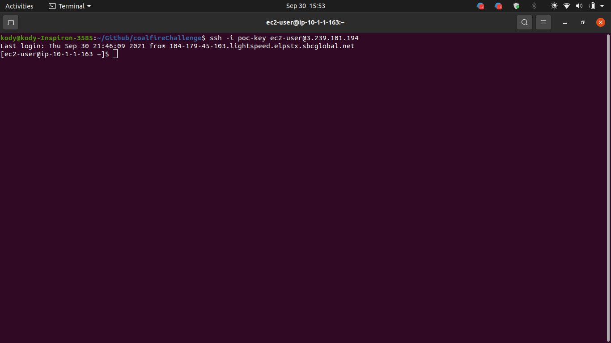

# Coalfire Coding Challenge

## Getting started

You will need to generate your own ssh key on your host machine named `poc-key` in order to log into the server hosted on sub2 (I know instructions said sub1, however there was no instance instructed to run on sub1, so I defaulted to sub2).  This key will be stored in the root directory of this project for testing sake.

These resources can be provisioned using terraform from the root directory of this project with the following commands:

```bash
terraform init

terraform plan

terraform apply
```

## Architecture diagram

- Here is a *rough* diagram on what the architecture looks like. Google jamboard may have been a poor choice :)



- And as requested, here is the screenshot of me logged into the instance on sub2 (again, there were no specifications to run an instance on sub1 as desribed in the challenge instructions)



## Challenges and Issues

- I believe the routing for the alb may need some tweaking. even though this wasn't part of the challenge, I don't believe it's routing traffic correctly

## Resources used

- Very heavy on [terraform docs](https://registry.terraform.io/providers/hashicorp/aws/latest/docs)

- [This](https://stackoverflow.com/questions/51739482/terraform-how-to-associate-multiple-subnet-to-route-table) very useful implementation of using dynamic subnets

- Used [this](https://stackoverflow.com/questions/59358540/how-to-use-templatefile-in-terraform-ec2-launch-template-user-data) to solve an issue with encoding when installing apache

- [This](https://stackoverflow.com/questions/51196693/terraform-how-to-create-multiple-aws-subnets-from-one-resource-block) was useful for creating the subnets

- [This artice](https://medium.com/@mda590/aws-routing-101-67879d23014d) helped quite a bit with understanding route tables and how they are used
